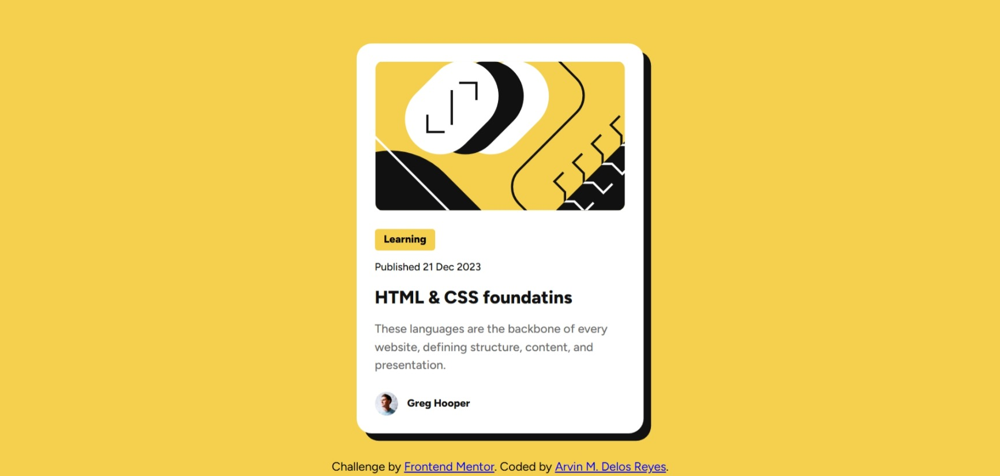

# Frontend Mentor - Blog preview card solution

This is a solution to the [Blog preview card challenge on Frontend Mentor](https://www.frontendmentor.io/challenges/blog-preview-card-ckPaj01IcS). Frontend Mentor challenges help you improve your coding skills by building realistic projects. 

## Table of contents

- [Overview](#overview)
  - [The challenge](#the-challenge)
  - [Screenshot](#screenshot)
  - [Links](#links)
- [My process](#my-process)
  - [Built with](#built-with)
  - [What I learned](#what-i-learned)
  - [Continued development](#continued-development)
  - [Useful resources](#useful-resources)
- [Author](#author)
- [Acknowledgments](#acknowledgments)


## Overview

### The challenge

Users should be able to:

- See hover and focus states for all interactive elements on the page

### Screenshot




### Links

- Solution URL: [https://github.com/arvndlr/blog-preview-card](https://github.com/arvndlr/blog-preview-card)
- Live Site URL: [https://blog-preview-card-five-navy.vercel.app/](https://blog-preview-card-five-navy.vercel.app/)

## My process
-Identify elements
-Declare variables (for colors)
-Divide the parts of the component
-Create a container and the elements each container
-Design the container and elements one by one (size, color)
-Adjust the margins and paddings
-Create hover effect
-Apply media queries for responsiveness
### Built with

- Semantic HTML5 markup
- CSS custom properties
- Flexbox
- Mobile-first workflow
- [React](https://reactjs.org/) - JS library
- [Next.js](https://nextjs.org/) - React framework
- [Styled Components](https://styled-components.com/) - For styles


### What I learned

In these project I learn meadia queries and hover effect. Where I get to know the elements change according to the set maximum with of the screen. Also the hover effect where I can add or change properties when hover event is detected.

Here is the code snippet of what I learnt:

```html
<p class="title">HTML & CSS foundatins</p>
```
```css
.title {
    margin: 0;
    font-size: 24px;
    line-height: 150%;
    letter-spacing: 0px;
    font-weight: 800;
    color: var(--text-primary);
}
.title:hover {
    color: var(--main-color);
    cursor: pointer;
}
@media only screen and (max-width: 600px) {
  /* Styles for screens 600px wide or smaller */
  .illustration {
    width: 279px;
    border-radius: 10px;
  }
  .text-container {
    width: 279px;
  }
  .attribution {
    display: flex;
    flex-direction: column;
  }
}
```

If you want more help with writing markdown, we'd recommend checking out [The Markdown Guide](https://www.markdownguide.org/) to learn more.


### Continued development

Use this section to outline areas that you want to continue focusing on in future projects. These could be concepts you're still not completely comfortable with or techniques you found useful that you want to refine and perfect.


### Useful resources

- [Google Fonts](https://fonts.google.com/selection/embed) - This helped me for importing the right font. I really like this library and I will use it my future projects
- [W3schools](https://www.w3schools.com/Css/css_positioning.asp) - This is an amazing website which helped me finally understand the css position: fixed;. I'd recommend it to anyone still learning this concept.


## Author

- Website - [Arvin Delos Reyes](https://arvin-personal-portfolio.vercel.app/)
- Frontend Mentor - [@arvndlr](https://www.frontendmentor.io/profile/arvndlr)
- Twitter - [@arvndlr](https://x.com/arvndlr)


## Acknowledgments

I thank the frontend mentor for its very detailed step by step guide where I am able to do it on my own. Through reading documentation in W3schools and the provided figma I am able to do it successfully.
